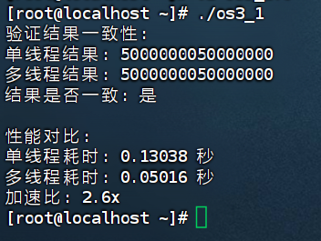

# 多线程编程实验
## 基本多线程程序设计
Hello实例
首先编写代码：

    #include <pthread.h>
    #include <stdio.h>
    #include <stdlib.h>

    void *worker(void *arg)
    {
        printf("Hello world!\n");
        return NULL;
    }

    int main(int argc, char *argv[])
    {
        pthread_t tid;

        if (pthread_create(&tid, NULL, worker, NULL))
        {
            printf("can not create\n");
            exit(1);
        }

        printf("main waiting for thread\n");

        pthread_join(tid, NULL);

        exit(0);
    }

得到如下输出结果：

    main waiting for thread
    Hello world!

## 多线程性能测试
为了测试多线程在大规模计算中的性能提升，编写了一个多线程计算和单线程计算对比的程序。该程序计算从 1 到 MAX_NUM（10000000）的整数之和，并使用2个线程分配计算任务，从而提高计算效率。

    编写代码如下：
    #include <stdio.h>
    #include <pthread.h>
    #include <sys/time.h>
    #include <stdint.h>

    #define MAX_NUM 10000000
    #define THREADS 4  // 根据CPU核心数调整

    typedef struct {
        uint64_t start;
        uint64_t end;
        uint64_t result;
    } ThreadArgs;

    // 线程计算函数
    void *calculate_sum(void *arg) {
        ThreadArgs *args = (ThreadArgs *)arg;
        uint64_t sum = 0;
        for (uint64_t i = args->start; i <= args->end; i++) {
            sum += i;
        }
        args->result = sum;
        return NULL;
    }

    // 单线程计算（保留原始实现用于对比）
    uint64_t single_thread_sum() {
        uint64_t sum = 0;
        for (uint64_t i = 1; i <= MAX_NUM; i++) {
            sum += i;
        }
        return sum;
    }

    // 多线程计算（优化版）
    uint64_t multi_thread_sum() {
        pthread_t threads[THREADS];
        ThreadArgs args[THREADS];
        uint64_t total_sum = 0;

        // 优化任务分配：每个线程处理连续区块
        uint64_t segment = MAX_NUM / THREADS;
        for (int i = 0; i < THREADS; i++) {
            args[i].start = i * segment + 1;
            args[i].end = (i == THREADS - 1) ? MAX_NUM : (i + 1) * segment;
            args[i].result = 0;
            pthread_create(&threads[i], NULL, calculate_sum, &args[i]);
        }

        // 优化：使用循环展开减少同步开销
        for (int i = 0; i < THREADS; i++) {
            pthread_join(threads[i], NULL);
            total_sum += args[i].result;
        }

        return total_sum;
    }

    // 高精度计时函数
    double get_wall_time() {
        struct timeval tv;
        gettimeofday(&tv, NULL);
        return (double)tv.tv_sec + (double)tv.tv_usec / 1000000.0;
    }

    int main() {
        // 预热：防止冷启动影响测试结果
        multi_thread_sum();

        // 单线程测试
        double start = get_wall_time();
        uint64_t sum_single = single_thread_sum();
        double time_single = get_wall_time() - start;
        
        // 多线程测试
        start = get_wall_time();
        uint64_t sum_multi = multi_thread_sum();
        double time_multi = get_wall_time() - start;

        // 结果验证
        printf("验证结果一致性:\n");
        printf("单线程结果: %lu\n", sum_single);
        printf("多线程结果: %lu\n", sum_multi);
        printf("结果是否一致: %s\n", (sum_single == sum_multi) ? "是" : "否");

        // 性能对比
        printf("\n性能对比:\n");
        printf("单线程耗时: %.5f 秒\n", time_single);
        printf("多线程耗时: %.5f 秒\n", time_multi);
        printf("加速比: %.1fx\n", time_single / time_multi);

        return 0;
    }

得到如下结果：

运行该程序后，可以观察到多线程计算的时间明显低于单线程计算，在多线程的支持下，程序的计算速度大约提高了一倍，证明了多线程在并行计算中的优势。

